# HID Automation

Automate HID mobile Application

## Introduction

HID is known for its excellence in physical access control products, logical access control products, and secure
issuance products that comprise cards, readers, smart card readers, networked access products, card printer/encoders (
FARGO) and software. It has specialization in segments to provide virtualization technology, cashless payment,
government ID, RFID for industry and logistics and Animal ID solutions and professional services. This framework will
cover the functionality of HID Global Mobile Application Unlock workflows.

## Framework Overview

• Automation Framework: Automation framework will be composed of:

o Test Scripts: Automation test scripts will be part of Automation Framework. Once the build process is completed, CI
Tool job will trigger the script execution.

o Test Data: Automation test data will be maintained through Scenario Outline -Examples. Based on the test suite,
automation framework will pick the related automated test cases along with the test data.

o Business Logic Functions: To isolate business logic from test case flow, separate module with function libraries will
be created for HID Global.

o Resource Files: All the properties files, apk files, runners files, feature files and testNG Runner files are kept in
test/Resource folder.

o Test Results: The Automation Framework will be consolidating test results from execution.

## Logical Design

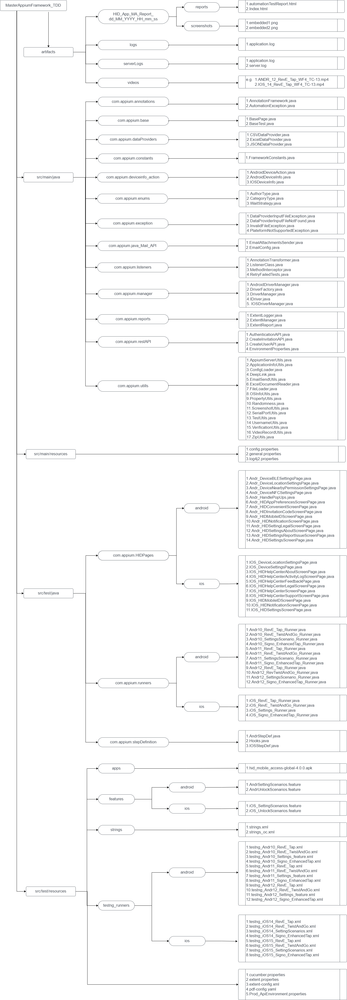

At high level Automation Framework will be divided in two parts:

• Core Framework Components that is available in main/Java folder

• Test Application Automation Scripts (Project Specific) is available in test/java folder

• Artifacts available in root folder

Below is the logical view of framework. Core Framework components will be creating base for test automation scripts for
a given AUT (Application Under Test). Project specific components are test automation scripts and code that require to
test “HID Application”. Project specific components will be using “Core Framework” components and use its functionality
to achieve testing goals.

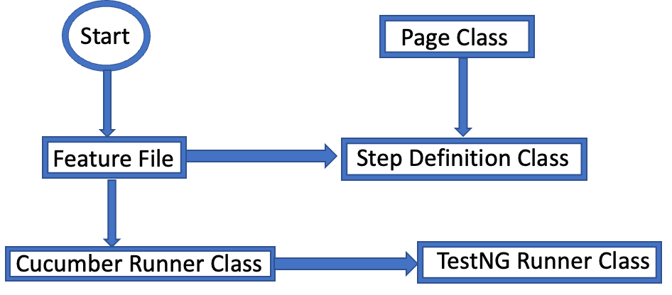

## Framework Architecture

Automation framework is designed to test “HID Application” on iOS and Android platform.

Framework Implementation

• All the source code will reside under main folder.

• Test folder will contain all project specific code.

Note: File names provided in this section may change during actual implementation and there can be additional files
added under test folder as needed.

## Main

Architecture Diagram for src/main

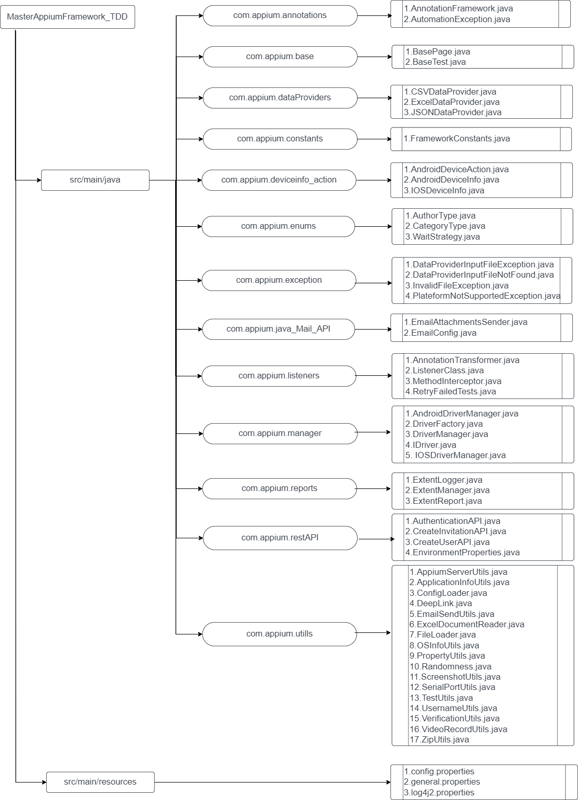

• Core Framework (src/main/java ): It contains code which is required to interact with Appium server, logging module and report module
etc. It contains all code which is common and can be re-use in other project with same software stack.
	o Following major packages are created under this core component of the framework.
		1. Base :- Wherein we are kept all the Base page or Base Test methods which are commonly distributed accross the framework.
			1.1 BaseTest.java :-  contains base functions to handle test application such as start app, stop app.
            1.2 BasePage.java :-  contains base functions to handle appium related methods e.g. - sendkeys, wait, click etc.
		2. Constant :- 	Wherein we are kept all the constants like path (Location) name and folder name details
		3. DeviceInfo Action:- Wherein we are kept all Device (iOS/Android) sepecifice operation
		4. Exception :- Wherein we are kept all custom exceptions.
		5. Listeners :- Wherein we are kept all the report level configuration.
		6. Manager :- Wherein we are kept all the Driver Manager (iOS/Android) file throught which we can handle our execution.
		7. RestAPI :- Wherein we are kept all Rest API common methods with in it which are utalized in out test files.
		8. Utills :- Wherein we are kept all re-usable utility functions like appium server utils, application info utils, config loader, screenshot, video record etc

• src/main/resources: It is the folder wherein we have keeping all the property files related to the framework configuration.
   o Below 3 files we have kept inside this folder
         1. config.properties :- Used for basic framework config setting e.g. - passed_tests_video, retry_failed_tests, retry_failed_tests_count
         2. general.properties :- Used for Appium server ip's 
         3. log4j2.properties :- Used for log4j setting

• Front End: It is a “HID” application which will going to test.

## Test

Project specific code will be in this section of the framework.

Architecture Diagram for src/test

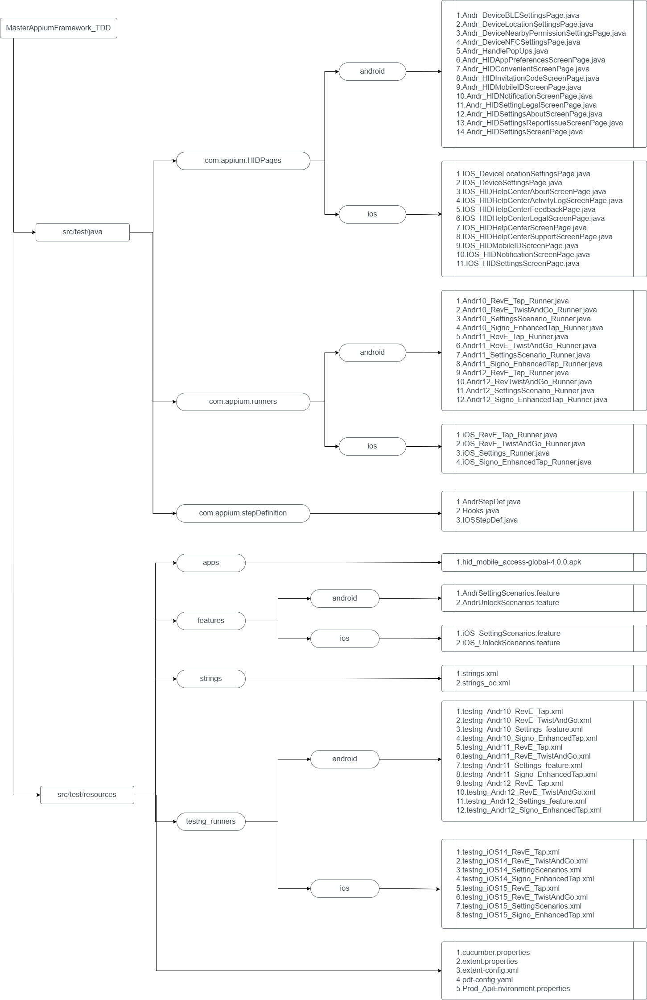

• src/test/java: Folder contains cucumber runner file, stepDefinition file, feature file and testNG runner file.

   o Following major packages are created under this
      1. HIDPages :- Wherein we are kept all our pages related to each function or screen, it is having 2 major component
            1.1 Locators :- Locators (Id, XPaths) are present in respective page class to locate elements.
            1.2 Pages :- Re-usable functions for a given screen will be stored in files under this folder. Getter methods
                        are created to access locators in other page class as well.
         o Following HID Pages (Examples) will be created under this folder.
            Android:
               1. Andr_DeviceBLESettingsPage
               2. Andr_DeviceLocationSettingsPage
               3. Andr_DeviceNFCSettingsPage
               4. Andr_HIDAppPreferencesScreenPage
               5. Andr_HIDConvenientScreenPage
               6. Andr_HIDInvitationCodeScreenPage
               7. Andr_HIDMobileIDScreenPage
               8. Andr_HIDNotificationScreenPage
               9. Andr_HIDSettingsScreenPage etc.
            iOS:
               1. IOS_DeviceLocationSettingsPage
               2. IOS_DeviceSettingsPage
               3. IOS_HIDHelpCenterActivityLogScreenPage
               4. IOS_HIDMobileIDScreenPage
               5. IOS_HIDNotificationScreenPage
               6. IOS_HIDSettingsScreenPage etc.
      2. Runners Files :- Wherein we are kept all our runner files which is required to run our feature files
      3. Step Definition Files :- Wherein we are kept all our test code which in the form of JAVA. this code is basically 
                                 glue which our feature files, with the help of runner file. 
         3.1 Hooks File :- Basically it is used to write the pre- and post-condition of our test cases.

• src/test/resources: It is the folder wherein we have keeping all the property files, app, feature files, and testNG 
runner files.

Feature File
o This is the file wherein we can write out test scenarios in the form of Gherkin Language (Given/When/Then).

TestNG Runner
o This is an XML file which is required to start out execution and having the base configuration details, and also it is
required to perform the parallel execution

## Test Output

Output folder contains test output in terms of logs, reports, screenshots and videos generated during or after the test
execution is completed. Path of this folder will be configurable so that Reports and Screenshots can be stored on shared
folder for access to other stakeholders.

In this framework we are storing all of our execution artifacts under the artifact folder which is placed in root 
location of framework.

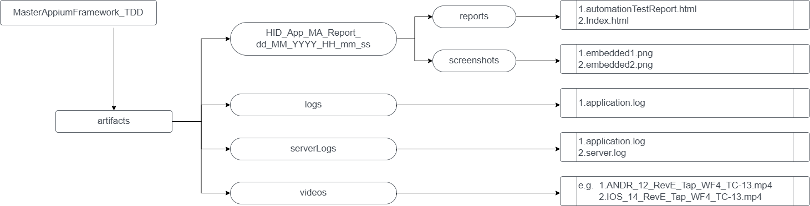

o logs:
• Contains logs from script execution for debugging and tracing.

o reports:
• It contains the date and time wise report

o snapshots:
• Contains the screenshot of screen whenever any test case failed or as per our requirement.

o videos:
• Contains the video of screen .

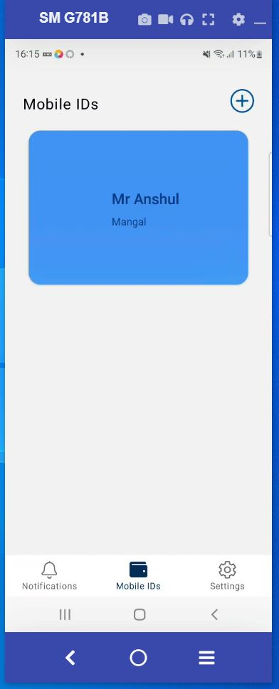

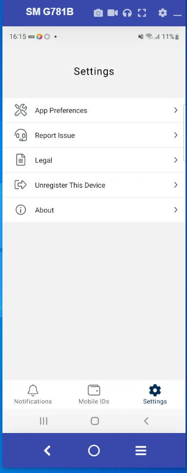

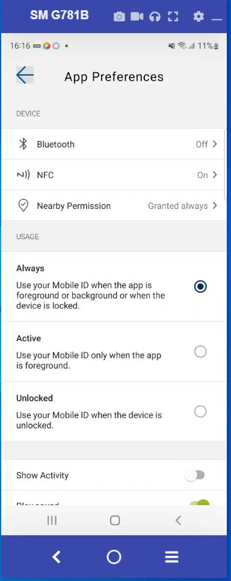

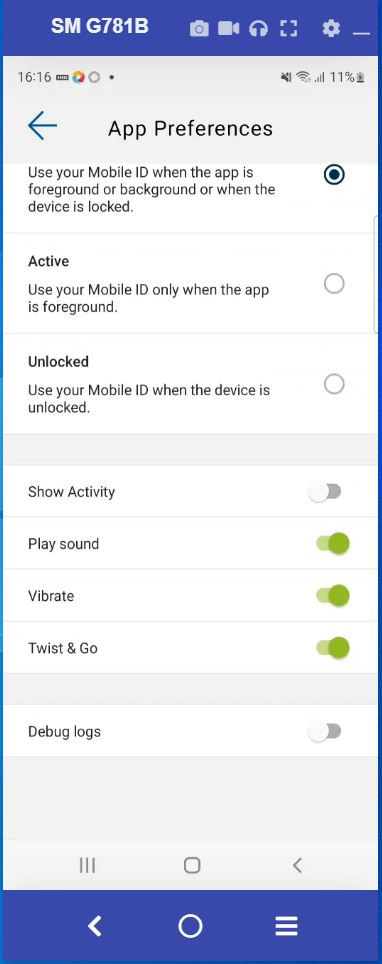

## Automation Code

o Java Coding Standards

• Naming Convention
class name-should be in uppercase letter and informative. e.g. Andr_HIDMobileIDScreenPage
method name - should start in camelCase e.g. getText(), setText(), sleep(), executeEXE() etc.
variable name - should start in camelCase and informative e.g. gain, filterColumn, speaker etc.
file name - should start in camelCase and informative e.g. mixerPage.js, commonUtils.js
constants name - should be in uppercase letter and informative. e.g. TIMEOUT, CSV_PATH etc.

• Naming standards for elements
• It should start in camelCase and informative.
• It should contain prefix to identify element using name.

[Naming Standarads of Elements](readMeDocuments/NamingStandardsofElements.xlsx)

• Object identification
• Identifying objects correctly is crucial for UI automation stability. The following is the preferred method of
identifying web elements. Top being most preferred and bottom being the least.

o ID
o Name
o Relative XPath
o CSS
o Class
o Tag

Naming Concvetion for the Test Cases
Below is naming convention structure for all the test scripts of Unlock Workflows of iOS and Android.

[Naming Standarads of TC](readMeDocuments/NamingConvetion_TC.xlsx)

o Reporting
• Extent report and Cucumber report were used to generate reports.

o Logging
• “log4j” provides functionality to log your message during the execution.
• “log4j” is provided by Node as NPM module, same is used to generate various logs.
• There are different types of logs such as error, info, and debug.

## Tools & Technology

1. Tools and Technology
   a. IDE - Intellij (Runtime version: 17.0.5+1-b653.23 amd64)
   b. Server - Appium (Appium v1.22.3)
   c. Build and Dependency Management tool - Maven (3.8.1)
   d. Programming Language - Java (Java 15)
   e. Testing Framework - testNG (7.6.1)
   f. Design Pattern - Page Object Model
   g. Logging Framework - Log4j (2.14.0)
   h. Reporting Framework - Extent Reporting (5.0.9)
   i. Videos Recording using Appium class

2. Other details
   a. Config.properties
   b. Parameterization using scenario outline with Example
   c. Independent Test Case
   d. Scrolling till element
   e. Multiple device parallel execution
   f. Screenshots using Base64
   g. Start and stop Appium server automatically

3. Third Party Libraries

   [Third Party Library](readMeDocuments/ThirdPartyLibrary.xlsx)

## Error Handling

• For any error or failure, debugging will start from log files. Log file will provide all the footprint of execution
which helps to narrow down the debug path.
• Another quick way for debug is report, report contains stack trace in case of failure. It can directly lead to
function which cause an issue.
• For every failure, framework captures the screenshot of current screen. That will help to catch any data related
problems.

----------------------------------------------------------------------------------------------------------------------------------
Reference Documents
[Appium setup on Windows](readMeDocuments/Appium Android Setup on Windows.docx)
-----------------------------------------------------
[Appium setup on Mac - iOS](readMeDocuments/Appium ios setup on Mac.docx)
-----------------------------------------------------
[Appium setup on Mac - Android](readMeDocuments/Appium Android setup on Mac.docx)
-----------------------------------------------------

------------------------------------------------------------
Updations and Implementations done:
------------------------------------------------------------

1. Parallel testing (Multiple devices - Android and iOS) (Real devices)
2. Application used: hid_mobile_access-global-4.0.2
3. ExtentReports V5.0.9
4. User has options for customization
5. Retry failed test cases with paraemetrized numbers
6. Custom Enums, Exceptions, Annotations
7. Videos for Failed test cases
8. Jenkins job setup

------------------------------------------------------------
**ExtentReports V5.0.9**

1. User can apply the Filters -

- DeviceType - Android Versions(12,11,10,9,8,7) and iOS Versions (14 and 15)

2. Screenshots are attached in the ExtentReport as Base64 format.

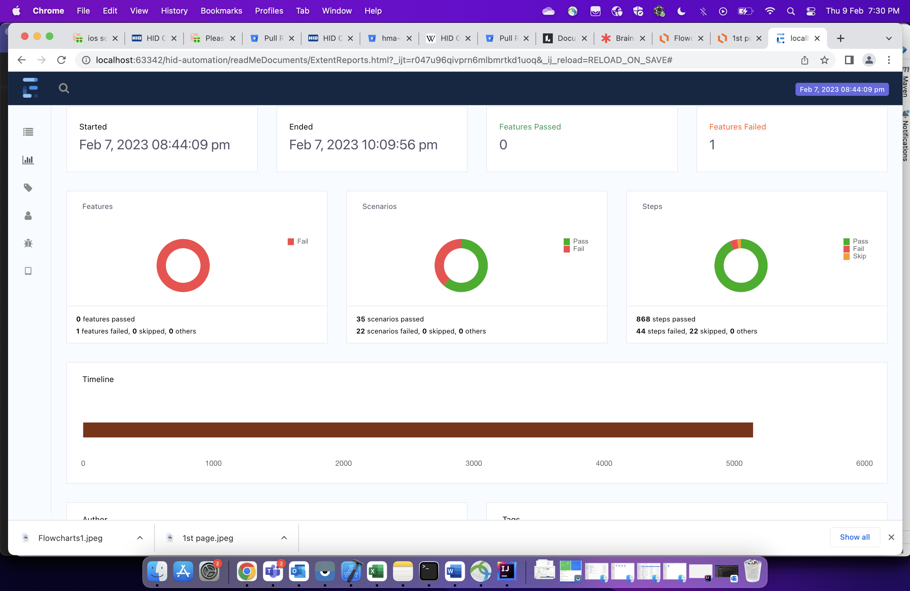
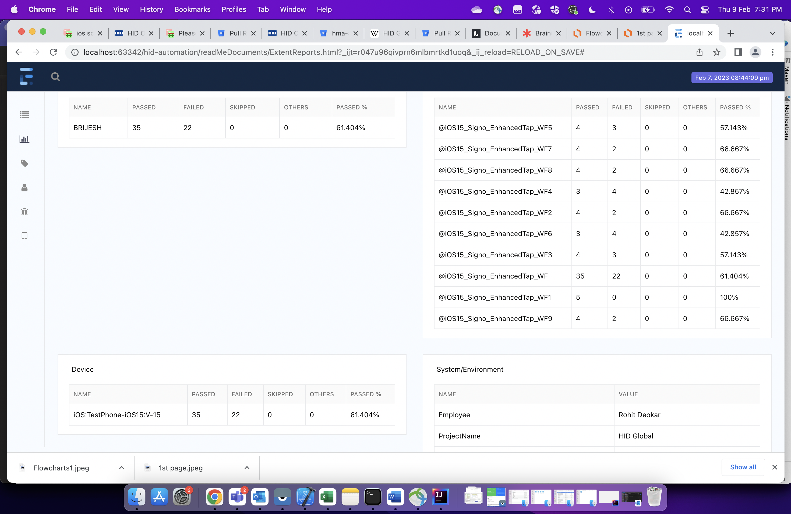
------------------------------------------------------------
**User has options for customization**

------------------------------------------------------------

------------------------------------------------------------
**How to run the Project from Local machine**

1. Pull the code into your machine and import in IDE (intelliJ).
2. Go to testng.xml -> Run this file as TestNG suite (you should have done the setup for Appium)
   It should start the execution

------------------------------------------------------------
**NOTE: **

1. Make sure devices (Real-Device) are ready
   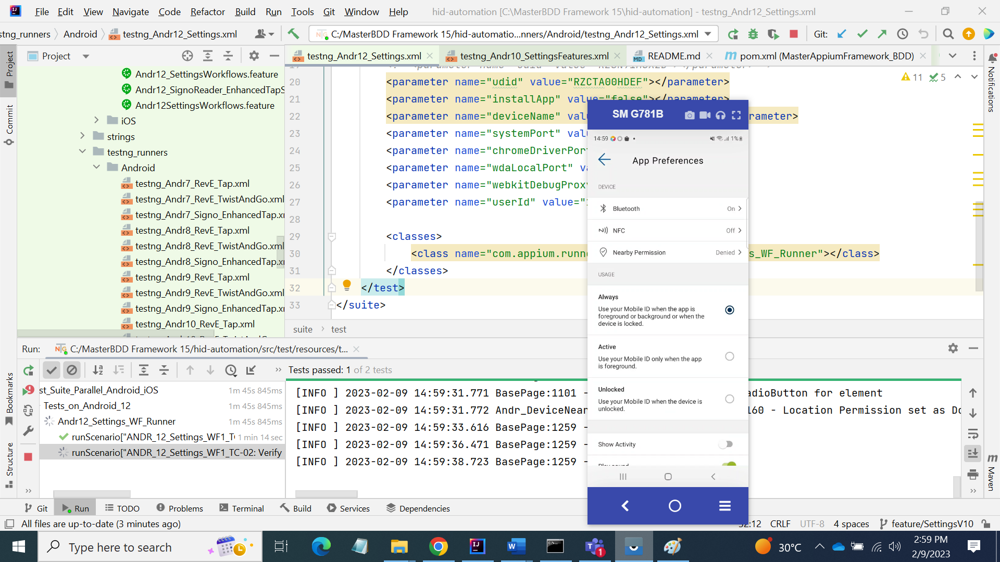

------------------------------------------------------------
**How to run the Project from Jenkins**
Note: CI Tool: User will be able to trigger the test execution from the CI-CD Tool (Jenkins), which in turn will
download
the source code from repository and build it for test execution. Jobs will be setup on CI-CD tool with parameters such
as Test Suite name and will be scheduled for periodic execution or manually triggering by users.

------------------------------------------------------------

